# 十一、可视化图表体系

> 一图胜千言。本章用图表形式呈现推荐系统的核心架构与算法，帮助快速理解复杂概念。

---

## 11.1 推荐系统整体架构

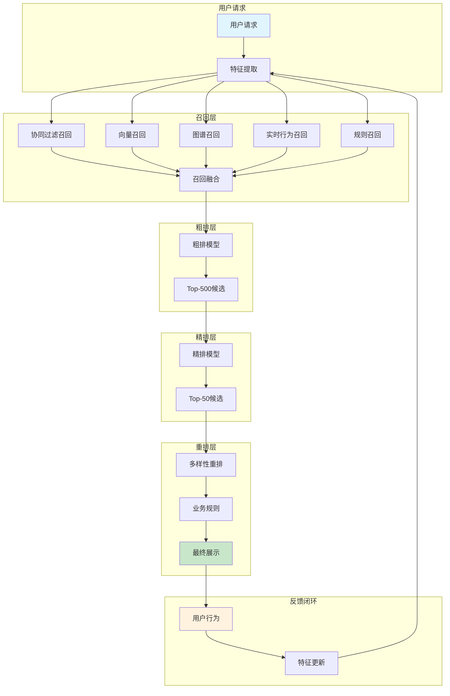

---

## 11.2 召回层详细架构

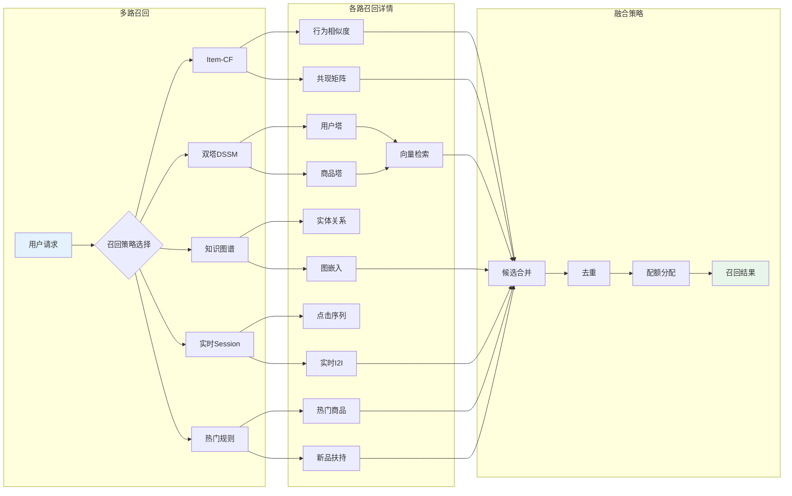

---

## 11.3 双塔DSSM模型结构

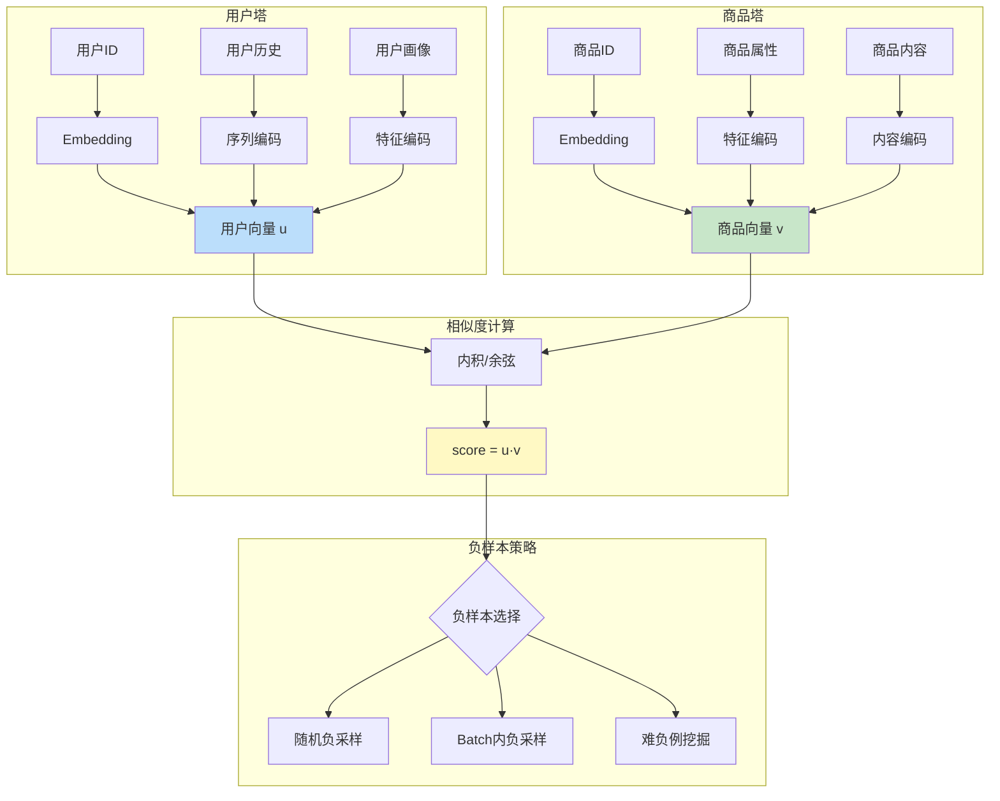

---

## 11.4 多任务学习网络结构对比

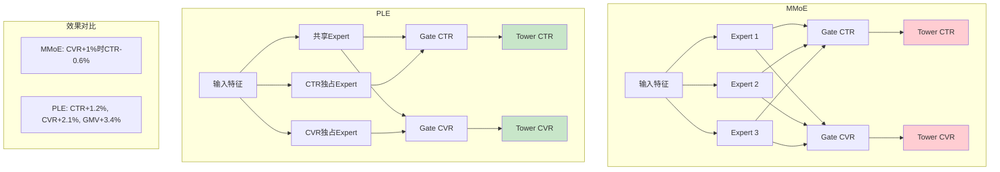

---

## 11.5 DPP多样性采样流程

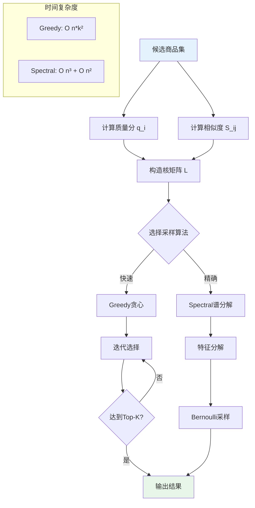

---

## 11.6 强化学习MDP建模

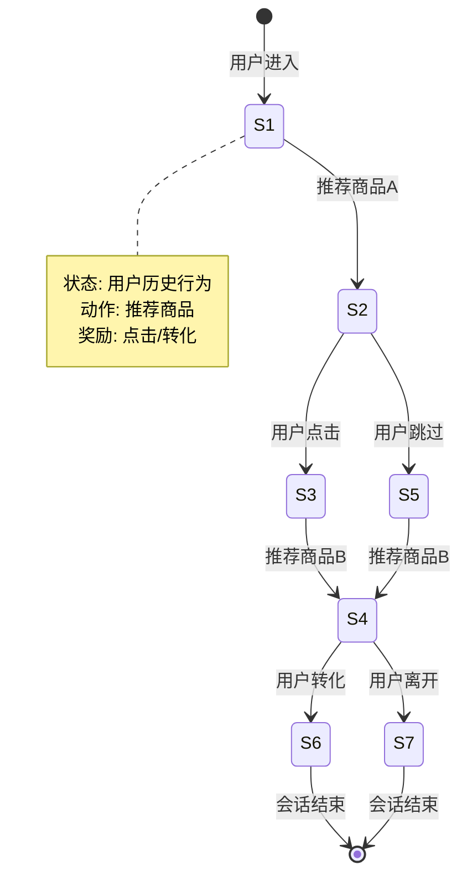

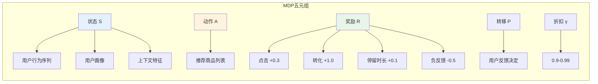

---

## 11.7 特征工程流程

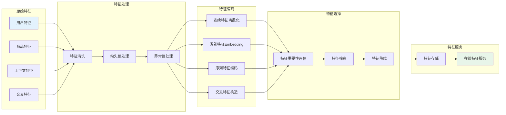

---

## 11.8 A/B实验设计

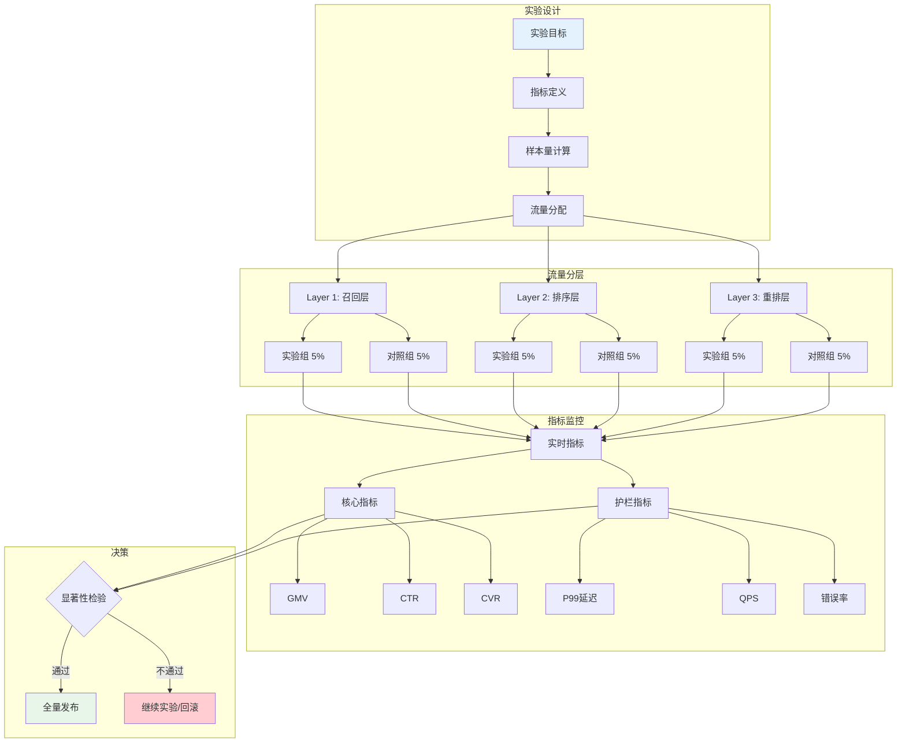

---

## 11.9 冷启动策略选择

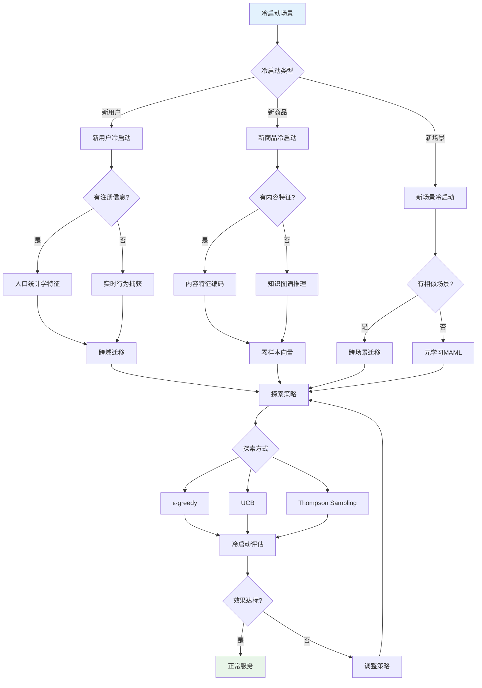

---

## 11.10 性能优化决策树

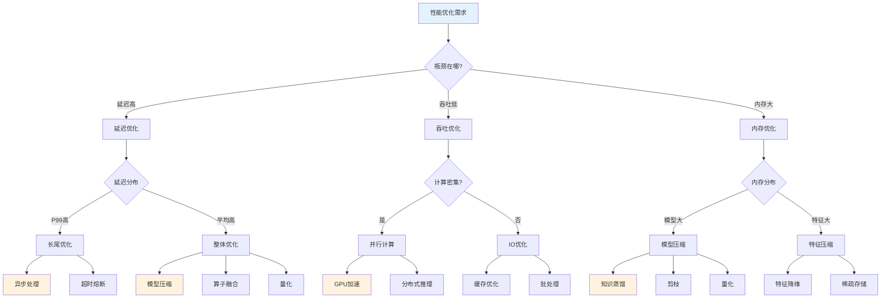

---

## 11.11 广告竞价流程

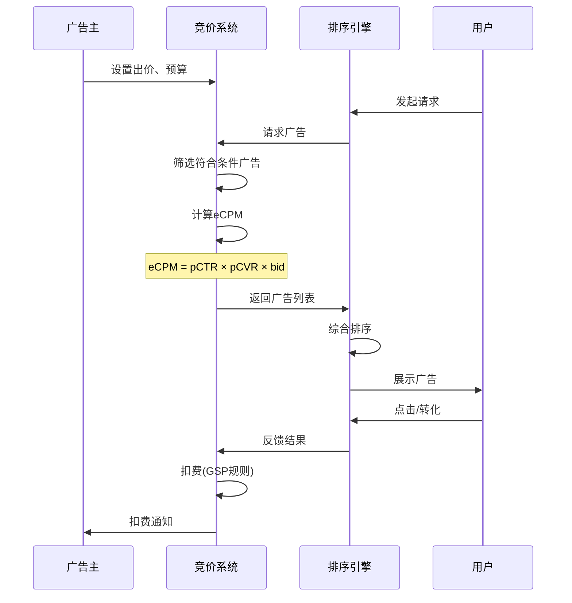

---

## 11.12 实时特征处理流程

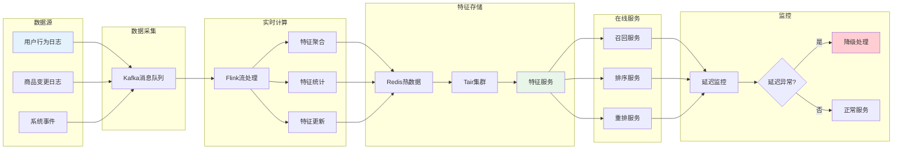

---

## 11.13 模型训练流程

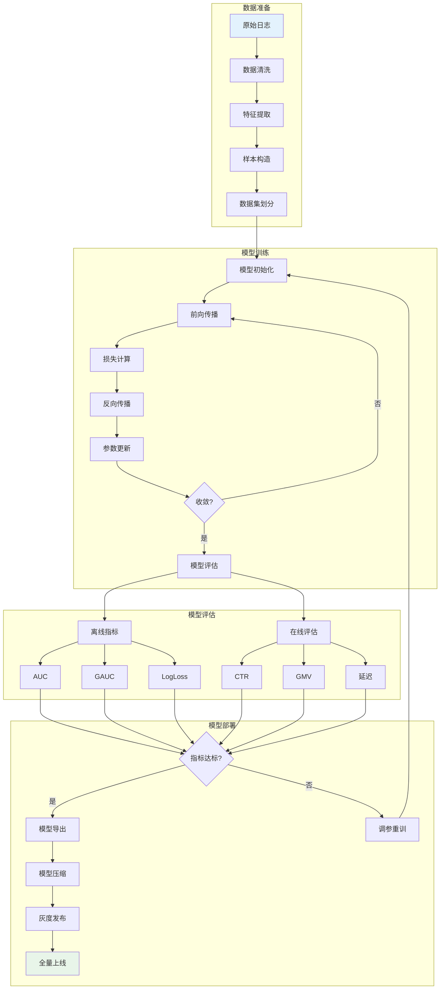

---

## 11.14 算法选型决策图

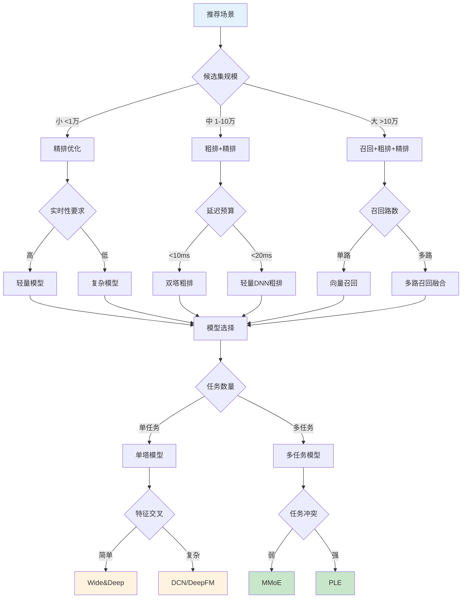

---

## 11.15 指标体系全景图

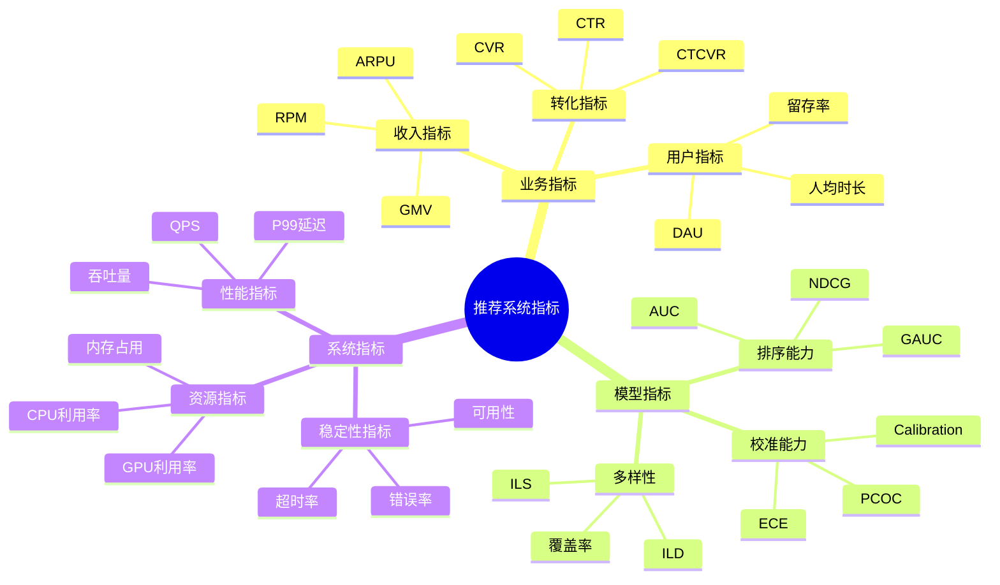

---

## 图表使用说明

### 如何阅读这些图表

1. **架构图**：理解系统整体结构，把握各模块关系
2. **流程图**：跟随箭头方向，理解数据/处理流程
3. **对比图**：关注颜色标注，理解不同方案的差异
4. **决策树**：根据条件分支，选择合适的技术方案
5. **时序图**：理解各组件间的交互顺序

### 图表与文档对应关系

| 图表 | 对应章节 |
|-----|---------|
| 推荐系统整体架构 | 第一章 召回链路 |
| 双塔DSSM模型 | 第一章 文本语义召回 |
| 多任务学习网络 | 第三章 多任务排序 |
| DPP采样流程 | 第四章 重排多样性 |
| 强化学习MDP | 第十章 强化学习 |
| 特征工程流程 | 第二章 特征工程 |
| A/B实验设计 | 第五章 系统架构 |
| 冷启动策略 | 第九章 冷启动 |
| 性能优化决策 | 第五章 性能优化 |

---

[← 上一章：强化学习在推荐中的应用](10-reinforcement-learning.md) | [返回目录](../README.md)
