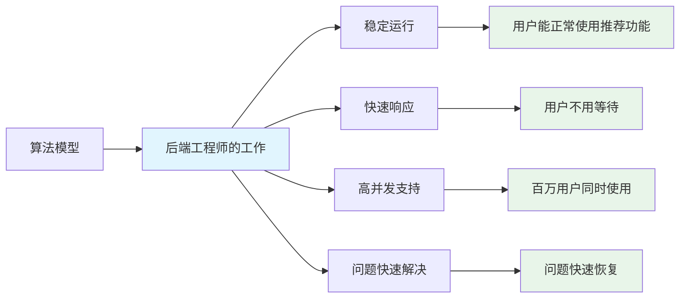
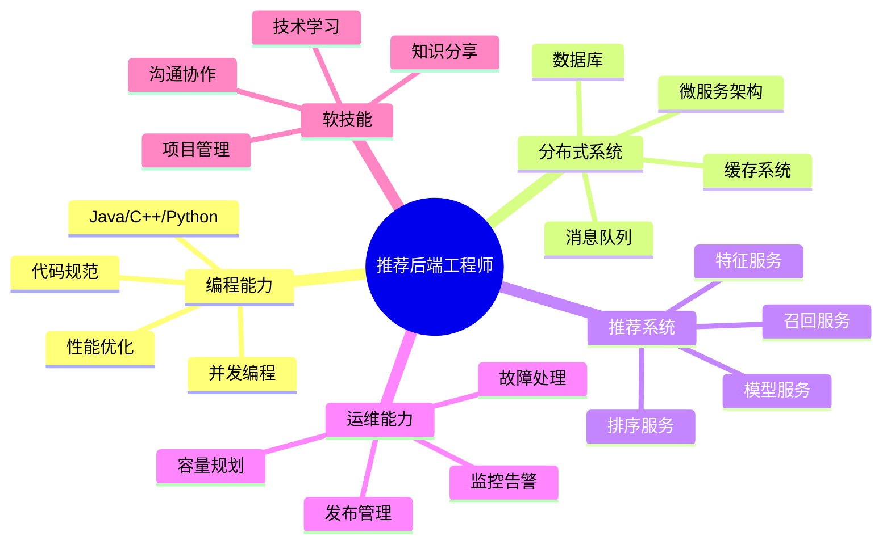
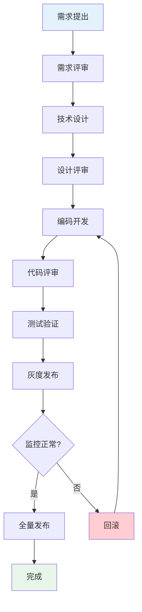
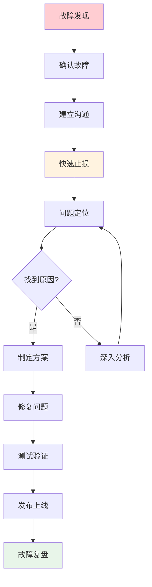
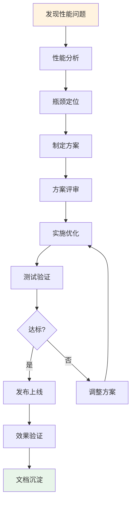
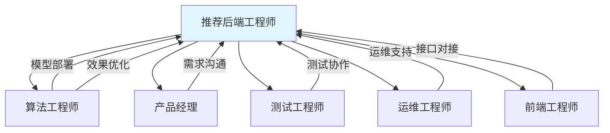

# 十六、推荐后端工程师工作内容详解

> 用通俗易懂的语言，向非专业人士介绍推荐后端工程师的工作内容。

---

## 16.1 这个岗位是做什么的？

### 16.1.1 一句话解释

```
推荐后端工程师 = 让推荐系统能够"稳定、快速、可靠"地运行的人
```

### 16.1.2 通俗类比

```
想象一个大型超市：

【算法工程师】= 选品经理
├── 决定货架上放什么商品
├── 决定商品怎么摆放
└── 让顾客更容易找到想要的商品

【推荐后端工程师】= 超市运营经理
├── 确保货架不倒塌（系统稳定）
├── 确保顾客能快速找到商品（响应快）
├── 确保超市能容纳足够多的顾客（高并发）
├── 确保收银系统正常工作（服务可用）
└── 当出现问题时快速解决（故障处理）
```

### 16.1.3 核心价值



---

## 16.2 日常工作全景图

### 16.2.1 一天的工作安排

```mermaid
gantt
    title 推荐后端工程师一天的工作
    dateFormat HH:mm
    axisFormat %H:%M
    
    section 上午
    查看监控           :09:00, 30m
    处理告警           :09:30, 30m
    核心开发           :10:00, 2h
    
    section 下午
    代码评审           :14:00, 1h
    系统优化           :15:00, 1h
    问题排查           :16:00, 1h
    
    section 晚上
    文档总结           :17:00, 1h
```



### 16.2.2 日常工作清单

```
┌─────────────────────────────────────────────────────────────┐
│                    推荐后端工程师日常工作                    │
├─────────────────────────────────────────────────────────────┤
│                                                             │
│  【早晨：健康检查】                                         │
│  ├── 📊 查看系统监控                                        │
│  │   ├── 昨晚有没有告警？                                   │
│  │   ├── P99延迟是否正常？（目标<30ms）                     │
│  │   ├── QPS是否平稳？                                      │
│  │   └── 错误率是否正常？（目标<0.1%）                      │
│  │                                                          │
│  ├── 🔔 处理告警                                            │
│  │   ├── 哪些告警需要处理？                                 │
│  │   ├── 是否需要升级？                                     │
│  │   └── 处理进度如何？                                     │
│  │                                                          │
│  └── 📋 查看今日任务                                        │
│      ├── 有什么需求要开发？                                 │
│      ├── 有什么问题要解决？                                 │
│      └── 有什么会议要参加？                                 │
│                                                             │
│  【上午：核心工作】                                         │
│  ├── 💻 代码开发                                            │
│  │   ├── 新功能开发                                         │
│  │   ├── Bug修复                                            │
│  │   └── 性能优化                                           │
│  │                                                          │
│  └── 👥 代码评审                                            │
│      ├── 评审同事代码                                       │
│      └── 接受他人评审                                       │
│                                                             │
│  【下午：系统维护】                                         │
│  ├── 🔧 系统优化                                            │
│  │   ├── 性能优化                                           │
│  │   ├── 架构优化                                           │
│  │   └── 代码重构                                           │
│  │                                                          │
│  ├── 🔍 问题排查                                            │
│  │   ├── 线上问题定位                                       │
│  │   ├── 性能问题分析                                       │
│  │   └── 依赖问题协调                                       │
│  │                                                          │
│  └── 📦 发布上线                                            │
│      ├── 灰度发布                                           │
│      ├── 监控观察                                           │
│      └── 问题回滚                                           │
│                                                             │
│  【傍晚：总结沉淀】                                         │
│  ├── 📝 文档编写                                            │
│  │   ├── 技术文档                                           │
│  │   ├── 问题复盘                                           │
│  │   └── 知识分享                                           │
│  │                                                          │
│  └── 📊 数据分析                                            │
│      ├── 系统指标分析                                       │
│      └── 优化效果评估                                       │
│                                                             │
└─────────────────────────────────────────────────────────────┘
```

---

## 16.3 核心工作内容详解

### 16.3.1 系统开发

```
什么是系统开发？

通俗解释：
┌─────────────────────────────────────────────────────────────┐
│  算法工程师设计了一个"推荐模型"                              │
│  ↓                                                          │
│  这个模型需要在电脑上运行                                   │
│  ↓                                                          │
│  后端工程师的工作：                                         │
│  ├── 把模型部署到服务器上                                   │
│  ├── 让模型能够接收用户请求                                 │
│  ├── 让模型能够快速返回结果                                 │
│  └── 让模型能够稳定运行                                     │
└─────────────────────────────────────────────────────────────┘

具体工作：
├── 1. 接口开发
│   ├── 定义接口格式（输入什么、输出什么）
│   ├── 实现接口逻辑（怎么处理请求）
│   └── 接口文档编写
│
├── 2. 服务开发
│   ├── 召回服务（从海量商品中筛选候选）
│   ├── 排序服务（对候选商品打分排序）
│   └── 重排服务（业务规则处理）
│
├── 3. 特征服务开发
│   ├── 用户特征获取
│   ├── 商品特征获取
│   └── 实时特征更新
│
└── 4. 支撑系统开发
    ├── 配置管理系统
    ├── 实验平台
    └── 监控系统
```

### 16.3.2 性能优化

```
什么是性能优化？

通俗解释：
┌─────────────────────────────────────────────────────────────┐
│  用户打开App，推荐内容加载太慢                              │
│  ↓                                                          │
│  用户等不及，关闭App                                        │
│  ↓                                                          │
│  后端工程师需要让推荐内容加载更快                           │
└─────────────────────────────────────────────────────────────┘

性能优化的目标：
├── P99延迟 < 30ms（99%的请求在30ms内完成）
├── QPS > 5万（每秒能处理5万个请求）
└── 错误率 < 0.1%（1000个请求中最多1个失败）

常见的性能优化方法：

【代码层面】
├── 减少不必要的计算
│   └── 例如：缓存计算结果，避免重复计算
│
├── 并行处理
│   └── 例如：同时获取多个特征，而不是一个一个获取
│
├── 批量处理
│   └── 例如：一次查询多个商品，而不是一个一个查询
│
└── 算法优化
    └── 例如：用更快的算法替代慢的算法

【架构层面】
├── 增加缓存
│   └── 把常用数据放在内存中，减少数据库查询
│
├── 异步处理
│   └── 把不紧急的任务放到后台处理
│
├── 分片处理
│   └── 把大任务拆成小任务，并行处理
│
└── 资源扩容
    └── 增加服务器数量
```

### 16.3.3 故障处理

```
什么是故障处理？

通俗解释：
┌─────────────────────────────────────────────────────────────┐
│  推荐功能突然不能用了                                       │
│  ↓                                                          │
│  用户看不到推荐内容                                         │
│  ↓                                                          │
│  后端工程师需要快速定位问题并修复                           │
└─────────────────────────────────────────────────────────────┘

故障处理流程：

┌──────────┐    ┌──────────┐    ┌──────────┐    ┌──────────┐
│  发现故障 │ →  │  快速止损 │ →  │  定位原因 │ →  │  修复问题 │
└──────────┘    └──────────┘    └──────────┘    └──────────┘
     │               │               │               │
     ▼               ▼               ▼               ▼
  监控告警        回滚/降级        日志分析        代码修复
  用户反馈        流量切换        链路追踪        测试验证
  业务反馈        应急处理        依赖检查        发布上线

常见故障类型：

【服务故障】
├── 服务无响应
│   ├── 原因：内存溢出、死锁、资源耗尽
│   └── 处理：重启服务、扩容、修复代码
│
├── 响应慢
│   ├── 原因：数据库慢、依赖慢、资源不足
│   └── 处理：优化查询、增加缓存、扩容
│
└── 错误率高
    ├── 原因：代码Bug、配置错误、依赖异常
    └── 处理：修复代码、修正配置、降级处理

【数据故障】
├── 数据不一致
│   ├── 原因：并发更新、缓存失效
│   └── 处理：修复数据、优化更新策略
│
└── 数据延迟
    ├── 原因：处理能力不足、网络问题
    └── 处理：扩容、优化链路
```

### 16.3.4 系统监控

```
什么是系统监控？

通俗解释：
┌─────────────────────────────────────────────────────────────┐
│  就像医院的监护仪，实时显示病人的生命体征                   │
│  ↓                                                          │
│  系统监控实时显示系统的"健康状态"                          │
│  ↓                                                          │
│  当指标异常时，自动告警                                     │
└─────────────────────────────────────────────────────────────┘

核心监控指标：

┌─────────────────────────────────────────────────────────────┐
│                    系统监控仪表盘                            │
├─────────────────────────────────────────────────────────────┤
│                                                             │
│  【延迟指标】                                               │
│  ├── P50延迟：10ms  ████████░░  正常                       │
│  ├── P90延迟：20ms  ██████████  正常                       │
│  └── P99延迟：28ms  ██████████  正常（目标<30ms）          │
│                                                             │
│  【吞吐指标】                                               │
│  ├── QPS：45000/秒  ██████████  正常                       │
│  └── 峰值QPS：52000 ██████████  正常                       │
│                                                             │
│  【错误指标】                                               │
│  ├── 错误率：0.05%  ████████░░  正常（目标<0.1%）          │
│  └── 超时率：0.02%  ████████░░  正常                       │
│                                                             │
│  【资源指标】                                               │
│  ├── CPU使用率：45% ████████░░  正常                       │
│  ├── 内存使用率：60%██████████  正常                       │
│  └── 网络IO：200MB/s████████░░  正常                       │
│                                                             │
└─────────────────────────────────────────────────────────────┘

告警规则：
├── P99延迟 > 50ms → 黄色告警
├── P99延迟 > 100ms → 红色告警
├── 错误率 > 0.1% → 黄色告警
├── 错误率 > 1% → 红色告警
├── CPU使用率 > 80% → 黄色告警
└── 服务不可用 → 红色告警
```

---

## 16.4 核心技能图谱

### 16.4.1 技能全景图



### 16.4.2 技能详解

```
【编程能力】—— 基础中的基础

必须掌握：
├── 至少一门编程语言（Java/C++/Python）
│   ├── Java：最主流，生态完善
│   ├── C++：高性能场景
│   └── Python：工具脚本
│
├── 并发编程
│   ├── 多线程编程
│   ├── 锁和同步
│   └── 线程池
│
├── 性能优化
│   ├── 代码优化
│   ├── 内存优化
│   └── IO优化
│
└── 代码规范
    ├── 命名规范
    ├── 注释规范
    └── 代码风格

【分布式系统】—— 推荐系统的基石

必须掌握：
├── 微服务架构
│   ├── 服务拆分
│   ├── 服务通信
│   └── 服务治理
│
├── 消息队列
│   ├── Kafka：日志流处理
│   ├── RocketMQ：业务消息
│   └── 使用场景：异步处理、解耦
│
├── 缓存系统
│   ├── Redis：主缓存
│   ├── 缓存策略
│   └── 缓存问题（穿透、击穿、雪崩）
│
└── 数据库
    ├── MySQL：关系型
    ├── MongoDB：文档型
    └── 读写分离、分库分表

【推荐系统特有】—— 区别于其他后端

必须掌握：
├── 召回服务
│   ├── 多路召回调度
│   ├── 向量检索（Faiss）
│   └── 倒排索引
│
├── 排序服务
│   ├── 特征获取
│   ├── 模型推理
│   └── 批量处理
│
├── 特征服务
│   ├── 特征存储
│   ├── 特征获取
│   └── 特征更新
│
└── 模型服务
    ├── TensorFlow Serving
    ├── TensorRT
    └── 模型热更新

【运维能力】—— 保障系统稳定

必须掌握：
├── 监控告警
│   ├── Prometheus + Grafana
│   ├── 指标设计
│   └── 告警配置
│
├── 故障处理
│   ├── 快速定位
│   ├── 应急处理
│   └── 根因分析
│
├── 发布管理
│   ├── 灰度发布
│   ├── 回滚机制
│   └── 应急预案
│
└── 容量规划
    ├── 流量预估
    ├── 资源评估
    └── 扩容方案
```

---

## 16.5 典型工作场景

### 16.5.1 场景一：新功能上线

```
场景：算法团队开发了一个新的召回模型，需要上线

后端工程师的工作：

Step 1: 需求理解
├── 和算法工程师沟通
│   ├── 模型输入是什么？
│   ├── 模型输出是什么？
│   ├── 性能要求是什么？
│   └── 依赖哪些特征？
│
└── 评估工作量
    ├── 需要开发什么接口？
    ├── 需要多少资源？
    └── 有什么风险？

Step 2: 技术设计
├── 接口设计
│   ├── 请求格式
│   ├── 响应格式
│   └── 错误码定义
│
├── 架构设计
│   ├── 服务如何部署？
│   ├── 如何保证高可用？
│   └── 如何保证高性能？
│
└── 评审
    ├── 团队评审
    └── 修改完善

Step 3: 开发实现
├── 编写代码
├── 单元测试
├── 集成测试
└── 代码评审

Step 4: 测试验证
├── 功能测试
├── 性能测试
└── 压力测试

Step 5: 发布上线
├── 灰度发布（1% → 10% → 50% → 100%）
├── 监控观察
└── 效果验证
```

### 16.5.2 场景二：性能优化

```
场景：监控显示P99延迟从25ms涨到了45ms

后端工程师的工作：

Step 1: 问题确认
├── 查看监控数据
│   ├── 延迟分布
│   ├── 时间趋势
│   └── 影响范围
│
└── 确认问题
    ├── 是持续高还是偶发？
    ├── 是所有接口还是部分接口？
    └── 什么时候开始的？

Step 2: 问题定位
├── 分析调用链
│   ├── 哪个环节耗时增加？
│   ├── 是CPU问题还是IO问题？
│   └── 是代码问题还是资源问题？
│
├── 查看日志
│   ├── 有没有异常日志？
│   ├── 有没有慢请求日志？
│   └── 有没有资源告警？
│
└── 定位根因
    ├── 代码变更？
    ├── 流量变化？
    ├── 资源不足？
    └── 依赖问题？

Step 3: 制定方案
├── 短期方案
│   ├── 扩容
│   ├── 降级
│   └── 限流
│
└── 长期方案
    ├── 代码优化
    ├── 架构优化
    └── 资源优化

Step 4: 实施优化
├── 开发优化代码
├── 测试验证
└── 灰度发布

Step 5: 效果验证
├── P99延迟是否下降？
├── 是否有副作用？
└── 文档更新
```

### 16.5.3 场景三：故障处理

```
场景：凌晨2点收到告警，推荐服务不可用

后端工程师的工作：

Step 1: 快速响应（5分钟内）
├── 确认故障
│   ├── 查看监控
│   ├── 确认影响范围
│   └── 确认严重程度
│
├── 建立沟通
│   ├── 创建故障群
│   ├── 拉入相关人员
│   └── 同步故障信息
│
└── 快速止损
    ├── 回滚最近变更
    ├── 重启服务
    └── 流量切换

Step 2: 问题定位（30分钟内）
├── 收集信息
│   ├── 日志分析
│   ├── 监控分析
│   └── 变更记录
│
├── 分析原因
│   ├── 代码问题？
    ├── 配置问题？
    ├── 资源问题？
    └── 依赖问题？
│
└── 验证假设
    └── 能否复现？

Step 3: 修复问题
├── 制定修复方案
├── 代码修复
├── 测试验证
└── 发布上线

Step 4: 故障复盘（24小时内）
├── 故障时间线
├── 影响范围
├── 根本原因
├── 处理过程
├── 经验教训
└── 改进措施
```

---

## 16.6 工作流程图

### 16.6.1 需求开发流程



### 16.6.2 故障处理流程



### 16.6.3 性能优化流程



---

## 16.7 与其他岗位的协作

### 16.7.1 协作关系图



### 16.7.2 协作内容详解

```
【与算法工程师协作】

协作场景：
├── 模型上线
│   ├── 算法：提供模型文件、输入输出格式
│   └── 后端：部署模型、提供服务接口
│
├── 特征工程
│   ├── 算法：定义特征需求
│   └── 后端：实现特征获取逻辑
│
├── 效果优化
│   ├── 算法：分析效果数据、提出优化方案
│   └── 后端：实现优化方案、支持A/B实验
│
└── 问题排查
    ├── 算法：分析模型问题
    └── 后端：分析系统问题

【与产品经理协作】

协作场景：
├── 需求沟通
│   ├── 产品：说明业务需求
│   └── 后端：评估技术可行性、工作量
│
├── 进度同步
│   ├── 产品：跟进项目进度
│   └── 后端：同步开发进度、风险
│
└── 效果评估
    ├── 产品：关注业务指标
    └── 后端：提供数据支持

【与测试工程师协作】

协作场景：
├── 测试准备
│   ├── 测试：编写测试用例
│   └── 后端：提供测试环境、数据
│
├── 问题修复
│   ├── 测试：发现Bug、提交工单
│   └── 后端：修复Bug、验证
│
└── 上线验证
    ├── 测试：执行上线验证
    └── 后端：配合问题排查

【与运维工程师协作】

协作场景：
├── 资源管理
│   ├── 运维：提供服务器资源
│   └── 后端：评估资源需求
│
├── 发布管理
│   ├── 运维：提供发布工具
│   └── 后端：执行发布操作
│
└── 故障处理
    ├── 运维：提供基础设施支持
    └── 后端：定位应用层问题
```

---

## 16.8 常见问题解答

### 16.8.1 入门问题

```
Q1: 推荐后端工程师和普通后端工程师有什么区别？

A: 主要区别在于：
├── 业务领域
│   ├── 普通后端：处理业务逻辑（如订单、支付）
│   └── 推荐后端：处理推荐逻辑（召回、排序、重排）
│
├── 技术重点
│   ├── 普通后端：业务逻辑正确性
│   └── 推荐后端：性能和实时性
│
├── 性能要求
│   ├── 普通后端：P99延迟通常100-500ms
│   └── 推荐后端：P99延迟通常<30ms
│
└── 协作对象
    ├── 普通后端：主要和产品、前端协作
    └── 推荐后端：主要和算法工程师协作

Q2: 需要懂算法吗？

A: 需要了解，但不需要精通
├── 需要了解的内容
│   ├── 推荐系统基本流程
│   ├── 常见算法原理
│   └── 模型输入输出格式
│
└── 不需要精通的内容
    ├── 算法推导
    ├── 模型训练
    └── 效果优化

Q3: 日常工作压力大吗？

A: 取决于公司业务阶段
├── 业务稳定期
│   ├── 压力较小
│   ├── 主要做优化和维护
│   └── 有时间学习新技术
│
└── 业务发展期
    ├── 压力较大
    ├── 需求多、迭代快
    └── 可能需要加班

Q4: 职业发展路径是什么？

A: 两条路径
├── 技术路径
│   ├── 初级工程师 → 中级工程师 → 高级工程师 → 资深工程师
│   └── 持续深耕技术
│
└── 管理路径
    ├── 技术Leader → 技术经理 → 技术总监
    └── 转向团队管理
```

### 16.8.2 技术问题

```
Q1: 最常用的技术是什么？

A: 按使用频率排序：
├── 每天都用
│   ├── 编程语言（Java/C++）
│   ├── 数据库（Redis/MySQL）
│   └── 监控系统（Prometheus/Grafana）
│
├── 经常用
│   ├── 消息队列（Kafka）
│   ├── 微服务框架
│   └── 容器化（Docker/K8s）
│
└── 偶尔用
    ├── 向量检索（Faiss）
    ├── 模型服务（TF Serving）
    └── 实时计算（Flink）

Q2: 需要掌握多少种编程语言？

A: 建议1门精通 + 1-2门了解
├── 精通（1门）
│   ├── Java：最主流，就业面广
│   └── 或C++：高性能场景
│
└── 了解（1-2门）
    ├── Python：写脚本、看算法代码
    └── Go：云原生场景

Q3: 如何提升技术能力？

A: 推荐路径：
├── 打好基础
│   ├── 编程语言深入
│   ├── 数据结构与算法
│   └── 计算机网络
│
├── 项目实践
│   ├── 参与核心项目
│   ├── 解决实际问题
│   └── 总结经验教训
│
├── 源码学习
│   ├── 阅读优秀开源项目
│   └── 学习设计思想
│
└── 技术交流
    ├── 参与技术分享
    ├── 参加技术会议
    └── 关注技术博客
```

---

## 16.9 总结

### 16.9.1 核心要点回顾

```
推荐后端工程师的核心工作：

1. 【系统开发】
   └── 让算法模型能够在线上运行

2. 【性能优化】
   └── 让系统运行得更快

3. 【故障处理】
   └── 当系统出问题时快速解决

4. 【系统监控】
   └── 实时监控系统健康状态

5. 【日常维护】
   └── 保证系统稳定运行

核心价值：
├── 稳定性：系统不崩溃
├── 性能：用户不用等待
├── 可靠性：数据不丢失
└── 可扩展性：能支撑业务增长
```

### 16.9.2 给新人的建议

```
给想入行的新人建议：

1. 【打好基础】
   ├── 至少精通一门编程语言
   ├── 了解分布式系统基础
   └── 学习推荐系统基本概念

2. 【动手实践】
   ├── 搭建一个简单的推荐系统
   ├── 实现一个召回服务
   └── 实现一个排序服务

3. 【持续学习】
   ├── 关注技术博客
   ├── 阅读开源项目
   └── 参与技术社区

4. 【积累经验】
   ├── 参与实际项目
   ├── 解决实际问题
   └── 总结经验教训

5. 【建立人脉】
   ├── 参加技术会议
   ├── 加入技术社群
   └── 结识同行朋友
```

---

[← 上一章：推荐后端工程师岗位全景指南](15-backend-engineer-guide.md) | [返回目录](../README.md)
